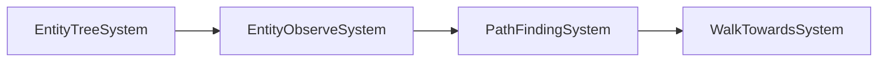

# AI and Pathfinding

Voxelize includes a built-in AI system for creating entities that navigate the world, chase players, and exhibit intelligent behavior. The system uses A* pathfinding, spatial indexing with KdTree, and a brain-based movement controller.

## Core Components

Three components work together to enable AI behavior:

### BrainComp

Controls how an entity moves—walking, jumping, sprinting. Think of it as the "motor cortex" of your AI.

```rust title="BrainComp Options"
BrainOptions {
    max_speed: 6.0,           // Maximum movement speed
    move_force: 12.0,         // Force applied when moving
    responsiveness: 120.0,    // How quickly it responds to direction changes
    running_friction: 0.4,    // Friction while moving
    standing_friction: 2.0,   // Friction while stopped

    jump_impulse: 8.0,        // Initial jump velocity
    jump_force: 1.0,          // Sustained jump force
    jump_time: 50.0,          // How long jump force applies (ms)
    air_jumps: 0,             // Number of mid-air jumps allowed

    sprint_speed_mult: 1.2,   // Speed multiplier when sprinting
    sprint_force_mult: 1.5,   // Force multiplier when sprinting
}
```

### TargetComp

Enables an entity to scan for and track targets. Filters by target type:

```rust title="Target Types"
// Track any entity (players or NPCs)
TargetComp::all()

// Only track players
TargetComp::players()

// Only track other entities
TargetComp::entities()
```

Once a target is found, `TargetComp` stores the target's position and ID.

### PathComp

Stores the computed A* path and pathfinding constraints:

```rust title="PathComp Parameters"
PathComp::new(
    100,                           // max_nodes: Maximum path length
    32.0,                          // max_distance: Maximum target distance
    10000,                         // max_depth_search: A* search depth limit
    Duration::from_millis(50),     // max_pathfinding_time: Time budget per tick
)
```

## Creating a Basic Enemy

Here's a zombie that chases players:

```rust title="Zombie Entity Loader"
use voxelize::{
    AABB, BrainComp, BrainOptions, InteractorComp, PathComp,
    PositionComp, RigidBody, RigidBodyComp, TargetComp,
};
use std::time::Duration;

world.set_entity_loader("zombie", |world, metadata| {
    // Define collision box (0.6 wide, 1.8 tall)
    let body = RigidBody::new(
        &AABB::new()
            .scale_x(0.6)
            .scale_y(1.8)
            .scale_z(0.6)
            .build()
    );

    // Register with physics system for entity-entity collisions
    let interactor = world.physics_mut().register(&body);

    // Extract spawn position from metadata
    let position: [f32; 3] = metadata
        .get("position")
        .and_then(|v| serde_json::from_value(v.clone()).ok())
        .unwrap_or([0.0, 80.0, 0.0]);

    world
        .create_entity(&nanoid!(), "zombie")
        .with(PositionComp::new(position[0], position[1], position[2]))
        .with(RigidBodyComp::new(&body))
        .with(InteractorComp::new(&interactor))
        .with(BrainComp::new(BrainOptions::default()))
        .with(TargetComp::players())  // Only chase players
        .with(PathComp::new(
            100,                           // max_nodes
            32.0,                          // max_distance (blocks)
            10000,                         // max_depth_search
            Duration::from_millis(50),     // max_pathfinding_time
        ))
});
```

Spawn the zombie:

```rust title="Spawning a Zombie"
world.spawn_entity_at("zombie", 10.0, 80.0, 10.0);

// Or with custom metadata
world.spawn_entity("zombie", serde_json::json!({
    "position": [10.0, 80.0, 10.0],
    "health": 100
}));
```

## How the AI Systems Work

The AI runs through a pipeline of systems each tick:



### 1. EntityTreeSystem

Builds a KdTree spatial index of all entities and players. This enables fast nearest-neighbor queries.

### 2. EntityObserveSystem

For each entity with a `TargetComp`, searches the KdTree for the closest target matching the filter type. Updates `target.position` and `target.id`.

### 3. PathFindingSystem

For entities with both `PathComp` and `TargetComp`, runs A* pathfinding from current position to target. The algorithm:

- Considers block passability (air, fluids)
- Handles jumping up 1 block
- Handles dropping down 1-2 blocks
- Applies path smoothing with Ramer-Douglas-Peucker algorithm
- Respects time and depth limits

### 4. WalkTowardsSystem

Operates the `BrainComp` to walk along the computed path:

- Advances through path nodes
- Triggers jumps when path goes up
- Smooths movement around corners
- Stops when reaching the target

## Customizing AI Behavior

### Faster Movement

Create a speedy enemy:

```rust title="Fast Enemy Options"
let fast_options = BrainOptions {
    max_speed: 10.0,              // Faster base speed
    sprint_speed_mult: 1.5,       // Faster sprinting
    move_force: 18.0,             // More acceleration
    responsiveness: 200.0,        // Quicker direction changes
    ..Default::default()
};

.with(BrainComp::new(fast_options))
```

### Longer Range Detection

Increase pathfinding distance:

```rust title="Long Range Pathfinding"
.with(PathComp::new(
    200,                           // More path nodes allowed
    64.0,                          // Double the detection range
    20000,                         // More search depth
    Duration::from_millis(100),    // More time for complex paths
))
```

### Different Target Priorities

Target other entities instead of players:

```rust title="Entity Targeting"
// A predator that hunts other mobs
.with(TargetComp::entities())

// Or a guard that attacks anything
.with(TargetComp::all())
```

## Example: Guard Entity

A guard that patrols and attacks hostile entities:

```rust title="Guard Entity"
world.set_entity_loader("guard", |world, metadata| {
    let body = RigidBody::new(
        &AABB::new()
            .scale_x(0.5)
            .scale_y(1.9)
            .scale_z(0.5)
            .build()
    );
    let interactor = world.physics_mut().register(&body);

    // Strong but slower movement
    let guard_options = BrainOptions {
        max_speed: 4.0,
        move_force: 15.0,
        responsiveness: 80.0,
        jump_impulse: 10.0,    // Higher jump
        air_jumps: 1,          // Can double-jump
        ..Default::default()
    };

    let position: [f32; 3] = metadata
        .get("position")
        .and_then(|v| serde_json::from_value(v.clone()).ok())
        .unwrap_or([0.0, 80.0, 0.0]);

    world
        .create_entity(&nanoid!(), "guard")
        .with(PositionComp::new(position[0], position[1], position[2]))
        .with(RigidBodyComp::new(&body))
        .with(InteractorComp::new(&interactor))
        .with(BrainComp::new(guard_options))
        .with(TargetComp::entities())  // Hunt other entities
        .with(PathComp::new(
            150,
            48.0,
            15000,
            Duration::from_millis(75),
        ))
});
```

## Client-Side Rendering

On the client, render AI entities using the `Entities` class:

```ts title="Client AI Rendering"
import * as VOXELIZE from "@voxelize/core";
import * as THREE from "three";

// Create a character mesh for enemies
class Enemy extends VOXELIZE.Entity<{
  position: number[];
  direction: number[];
}> {
  character: VOXELIZE.Character;

  constructor(id: string) {
    super(id);
    this.character = new VOXELIZE.Character({
      nameTagOptions: {
        fontFace: "monospace",
        backgroundColor: "#ff0000",
      },
    });
    this.character.username = "Zombie";
    this.add(this.character);
  }

  onCreate = (data: { position: number[]; direction: number[] }) => {
    this.character.set(data.position, data.direction);
  };

  onUpdate = (data: { position: number[]; direction: number[] }) => {
    this.character.set(data.position, data.direction);
  };

  update = () => {
    this.character.update();
  };
}

// Register the entity type
const entities = new VOXELIZE.Entities();
entities.registerEntity("zombie", (id) => new Enemy(id));

// Add to scene
world.add(entities);

// Update in render loop
function animate() {
  entities.update();
  requestAnimationFrame(animate);
}
```

## Accessing Path Data on Client

The computed path syncs to metadata. Useful for debugging or path visualization:

```ts title="Path Visualization"
entities.onEntityUpdate = (entity, data) => {
  if (data.path) {
    // data.path is an array of [x, y, z] coordinates
    console.log("Current path:", data.path);

    // Optionally draw debug lines
    drawPathLine(data.path);
  }
};
```

## Performance Tips

1. **Limit pathfinding distance** - Set `max_distance` appropriately. Pathfinding across 100+ blocks is expensive.

2. **Reduce search depth** - Lower `max_depth_search` for faster (but potentially incomplete) paths.

3. **Budget time wisely** - `max_pathfinding_time` prevents any single entity from blocking the tick.

4. **Use entity loaders** - They handle spawning and cleanup automatically.

5. **Consider target types** - `TargetComp::players()` is faster than `TargetComp::all()` when you only need player tracking.

## Preventing Persistence

AI entities that shouldn't save between restarts:

```rust title="Non-Persistent Entity"
use voxelize::DoNotPersistComp;

world
    .create_entity(&nanoid!(), "temporary_mob")
    // ... other components
    .with(DoNotPersistComp)
```

## Full Implementation

Complete server setup with AI entities:

```rust title="Full Server Example"
use actix_web::web::Data;
use nanoid::nanoid;
use std::time::Duration;
use voxelize::{
    AABB, BrainComp, BrainOptions, InteractorComp, PathComp,
    PositionComp, Registry, RigidBody, RigidBodyComp, Server,
    TargetComp, Voxelize, World, WorldConfig,
};

#[actix_web::main]
async fn main() -> std::io::Result<()> {
    let server = Server::new().port(4000).build();

    // Create registry with blocks
    let mut registry = Registry::new();
    registry.register_block("Dirt", &["dirt.png"; 6]);
    registry.register_block("Grass", &[
        "grass_side.png",
        "grass_side.png",
        "grass_top.png",
        "dirt.png",
        "grass_side.png",
        "grass_side.png",
    ]);
    registry.generate();

    let config = WorldConfig::new()
        .seed(12345)
        .build();

    let mut world = World::new("main", &config);
    world.set_registry(&registry);

    // Register zombie entity loader
    world.set_entity_loader("zombie", |world, metadata| {
        let body = RigidBody::new(
            &AABB::new()
                .scale_x(0.6)
                .scale_y(1.8)
                .scale_z(0.6)
                .build()
        );
        let interactor = world.physics_mut().register(&body);

        let position: [f32; 3] = metadata
            .get("position")
            .and_then(|v| serde_json::from_value(v.clone()).ok())
            .unwrap_or([0.0, 80.0, 0.0]);

        world
            .create_entity(&nanoid!(), "zombie")
            .with(PositionComp::new(position[0], position[1], position[2]))
            .with(RigidBodyComp::new(&body))
            .with(InteractorComp::new(&interactor))
            .with(BrainComp::new(BrainOptions::default()))
            .with(TargetComp::players())
            .with(PathComp::new(100, 32.0, 10000, Duration::from_millis(50)))
    });

    // Spawn some zombies
    for i in 0..5 {
        let x = 10.0 + (i as f32 * 5.0);
        world.spawn_entity_at("zombie", x, 80.0, 10.0);
    }

    server.add_world(world).expect("Failed to add world");

    Voxelize::run(server).await
}
```
